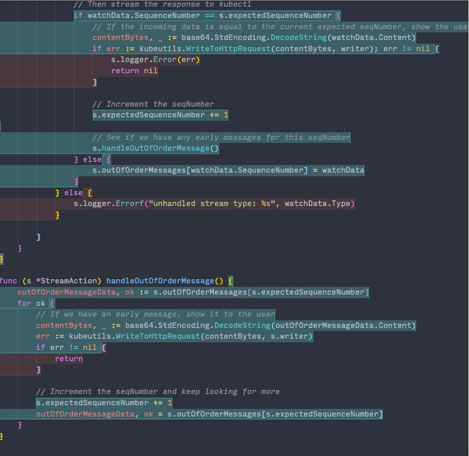

# BastionZero

[BastionZero](https://www.bastionzero.com) is the Trustless Access Platform that connects engineers to infrastructure without risking the keys to your kingdom. Access your Linux servers, containers, clusters, databases, and web servers in any cloud or on-prem environment using our [Multi-Root Zero-Trust Access Protocol](https://github.com/bastionzero/whitepapers/blob/main/mrzap/README.md). For questions regarding the product, please contact support@bastionzero.com.

## Architecture

The **bzero** Go library compiles to two different executables: an **agent** that runs on your remote targets and a **daemon** that runs locally. Both programs communicate with the BastionZero cloud service. Once the agent registers itself with BastionZero and establishes a control channel connection, it awaits incoming data channel connections. The daemon initiates these connections in tandem with the [ZLI](https://github.com/bastionzero/zli), a client CLI for BastionZero. The agent and daemon conduct secure data transmission using [MrTAP](https://github.com/bastionzero/whitepapers/blob/main/mrzap/README.md)

## Installation

See our documentation for more information on how to get started with the [agent](https://docs.bastionzero.com/docs/deployment/installing-the-agent) and [daemon](https://docs.bastionzero.com/docs/deployment/installing-the-zli) (which comes bundled with the ZLI)

## Developer processes

With Go 1.18 or later installed, you can build the agent and daemon locally:
```sh
# to build the agent, starting from repo root
cd bctl/agent && go build .
# to build the daemon, starting from repo root
cd bctl/daemon && go build .
```

You can then run the agent and daemon by running the executable.

## Testing

Unit tests are written using the [Ginkgo framework](https://github.com/onsi/ginkgo) for both the agent and daemon projects as well as for the common bzerolib library code. Tests should be written as close to the component they are testing (in the same directory as the files they test) and should have a `_test` filename suffix. For more information on our approach to testing, see the [wiki](https://github.com/bastionzero/bzero/wiki/Unit-testing-with-Ginkgo-and-Testify)

To find and run all unit tests within a go project first `cd` into the root directory of the project (or a subdirectory) and run the command `go test -v ./...`.

To run all daemon/agent unit tests:

```sh
cd bctl # you can also run more specific tests by cd'ing into a more specific directory like bctl/daemon
go test -v ./... -timeout 5000ms
```

To run bzerolib unit tests:

```sh
cd bzerolib
go test -v ./...
```

### Test coverage

In VSCode's Go settings, you can also toggle "Cover on Save" or "Cover on Test Package" to see highlighting of which lines of all these files are covered by the tests!
